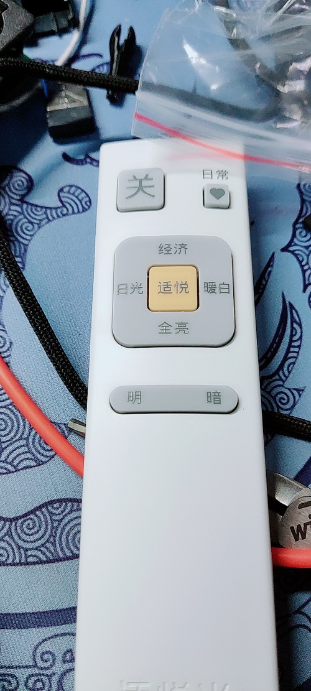

# 红外遥控器

遥控器使用说明（由于录码比较繁琐，建议大家贡献自己录的码，然后集成到插件之中使用）

下面是大家贡献的设备与命令，通过调用 `remote.send_command` 服务传入设备与命令即可

```yaml
创维电视:
  power: 开关机
  down: 下一频道
海信HZ65U7E:
  power: 开关机
  up: 上
  down: 下
  left: 左
  right: 右
  source: 信号来源
  enter: 确认
  back: 返回
  menu: 菜单
  volumedown: 音量减小
  volumeup: 音量增加
  mute: 静音
  sleep: 休眠
松下吸顶灯HKC9603:
  poweroff: 关
  poweron: 适悦按键
乐视超3X50:
  power: 开关
  menu: 菜单
  back: 返回
  volumeup: 音量+
  volumedown: 音量-
  up: 上
  down: 下
  left: 左
  right: 右
  back: 返回
```

### 松下吸顶灯HKC9603

